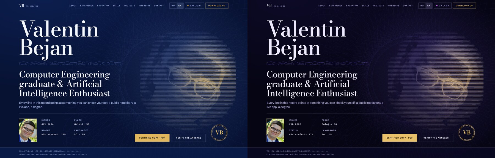
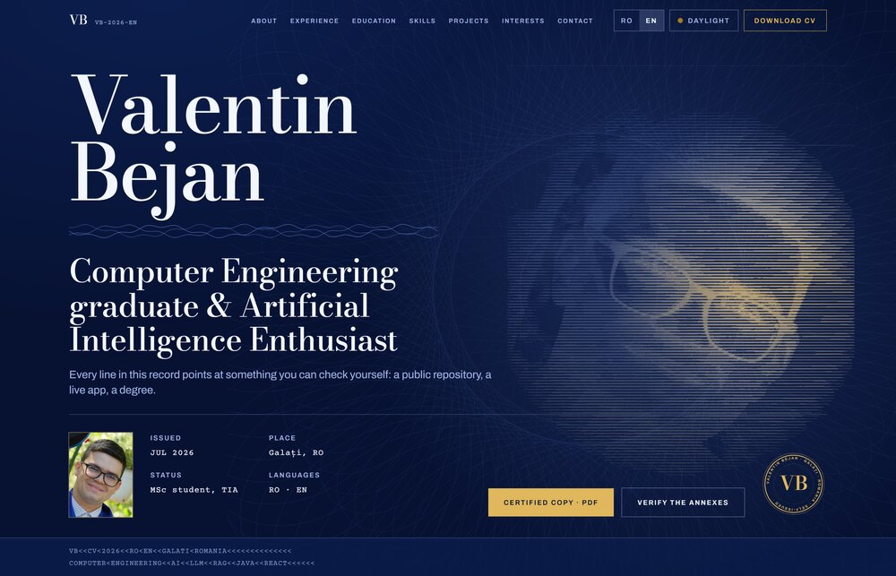
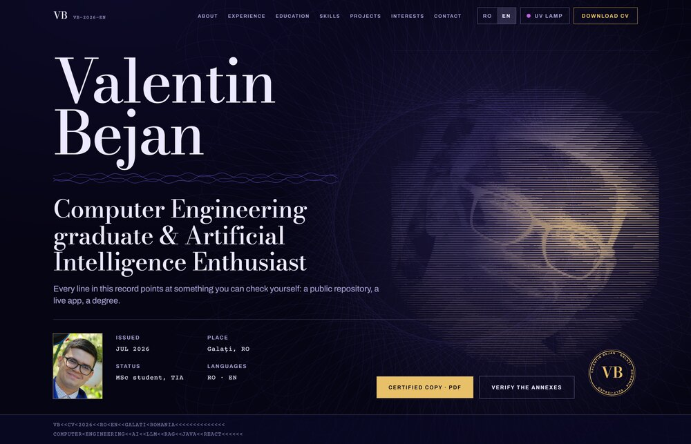

# Valentin Bejan — CV

A bilingual personal CV site, built as a **self-issued credential**: a security-printed document where every line carries a reference you can go and check for yourself.

**Live:** [valentin-bejan-cv.vercel.app](https://valentin-bejan-cv.vercel.app/en) · [English](https://valentin-bejan-cv.vercel.app/en) · [Română](https://valentin-bejan-cv.vercel.app/ro)



---

## The idea

Most developer portfolios are a dark page, one accent colour and a grid of project cards. This one refuses that arrangement and commits to a different world: **intaglio security printing** — the visual language of certificates, banknotes and diploma supplements.

That choice is not decoration. It does real work:

- **A credential's job is to be verifiable.** Every claim on the page — each job, each degree, each project — links to a public repository, a live application or the institution that issued it. The security-printing look is the promise; the links are what keep it.
- **Romanian diploma supplements are issued bilingually.** The RO/EN pair is native to the document, not a widget bolted onto it.
- **Security documents are read under two lights.** So the theme toggle is *daylight* and a *UV inspection lamp*, not a generic light/dark switch — under UV the guilloche fluoresces and the palette shifts to what the lamp would reveal.
- **It is honestly self-issued.** No institutional marks are used, and the document says so in its own closing statement.

| Daylight | UV lamp |
| --- | --- |
|  |  |

## Stack

| | |
| --- | --- |
| Framework | Next.js 14 (App Router), React 18, TypeScript |
| Styling | Tailwind CSS 3, CSS custom properties for both lighting conditions |
| i18n | `next-intl` — locale routing at `/ro` and `/en` |
| Theming | `next-themes` (`daylight` / `uv`) |
| Icons | `lucide-react` |
| Hosting | Vercel |

Both locales are prerendered as **static HTML**. There is no runtime animation library — motion is CSS plus `IntersectionObserver`, and `prefers-reduced-motion` is honoured globally.

## Running it

Requires Node 18.17 or newer.

```bash
npm install
npm run dev      # http://localhost:3000 → redirects to /ro
npm run build    # production build
npm run start    # serve the production build
npm run lint
```

## Editing the content

**All copy lives in one file: [`lib/translations.ts`](lib/translations.ts).** It is a single object with a `ro` and an `en` branch covering every string on the site — navigation, the cover, the statement, jobs, degrees, competences, projects, contact.

> Every key must exist in **both** locales. Neither language is a translation of the other; both are complete.

Project entries take a `tier`. Mark one `'principal'` and it becomes a full annex with its own reference number, description and proof link; leave it off and it drops into the compact "earlier work" ledger at the bottom.

```ts
{
  name: 'Japanese Voice Studio',
  description: '…',
  tech: ['Next.js', 'Modal', 'WASM'],
  link: 'https://irodori-tts-studio.vercel.app/',
  linkType: 'website',   // 'github' | 'website' | 'linkedin'
  tier: 'principal',
}
```

The downloadable CV is a single English-language PDF, referenced from one place — [`lib/cv.ts`](lib/cv.ts). Drop a new file in `public/cv/` and update that constant.

## Design system

Two documents at the repo root describe the site so it can be extended without re-deriving anything:

- **[`DESIGN.md`](DESIGN.md)** — the visual system as actually built: the token set in both lighting conditions, the type ramp and what each step is for, spacing, the component vocabulary, and the named rules the build holds to (no cards, no gradient text, zero corner radius, one job per colour).
- **[`PRODUCT.md`](PRODUCT.md)** — who the site is for, what it must prove, and what must never be fabricated on it.

Colours and type are defined as tokens in [`app/globals.css`](app/globals.css) and mapped in [`tailwind.config.ts`](tailwind.config.ts). Nothing should reach for a literal hex or a one-off font size.

## Generated assets

The guilloche — the engine-turned rosettes and woven rules — is real geometry, not an image traced by hand. It is computed from hypotrochoid and superimposed-sine equations and written out as static SVG:

```bash
node scripts/gen-guilloche.mjs
```

This writes `public/img/guilloche-rosette.svg` and `public/img/lathe-rule.svg`. They are applied as CSS `mask-image` over a token-driven background, so a single asset tints correctly in both lighting conditions. Re-run the script only if you change the curve parameters.

> **Note:** stroke width in those files is pre-divided by the render scale, because `vector-effect="non-scaling-stroke"` does not survive mask rasterisation. Every rosette is therefore sized to roughly the same scale on purpose — scaling one far larger or smaller changes its hairline weight and breaks the set.

## Structure

```
app/
  [locale]/          layout (fonts, metadata, locale) and the page
  globals.css        design tokens + document primitives
components/
  Hero.tsx           the cover — first viewport
  About.tsx          statement of the bearer
  Experience.tsx     service record
  Education.tsx      credentials
  Skills.tsx         schedule of competences
  Projects.tsx       annexes + earlier-work ledger
  Contact.tsx        countersignature (closes the document)
  security/          guilloche, seal, stamp, microprint, section shell
lib/
  translations.ts    all RO/EN copy
  cv.ts              the downloadable CV
scripts/
  gen-guilloche.mjs  generates the line-work SVGs
public/
  cv/                the CV PDF
  img/               portrait, engraved plate, generated guilloche
```

## Accessibility

- WCAG AA contrast in both lighting conditions; the tertiary ink and verification colours were chosen by computation against both interior grounds.
- `lang` is set per locale, and the language pair is exposed via `hreflang`.
- Full keyboard operation, visible focus rings, and `prefers-reduced-motion` respected.

## A note on assets

The original camera file for the portrait is **not** in this repository — it is 19 MB and never served. What ships is in `public/img/`: a web-sized photograph and a line-engraved plate derived from it, used as the cover watermark. Keep the original backed up somewhere else.

---

© 2026 Valentin Bejan. All rights reserved. The code is public for reference; the content, photography and CV are not licensed for reuse.
